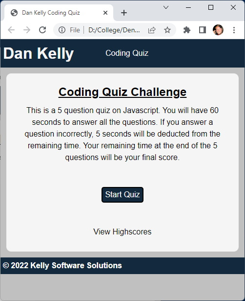
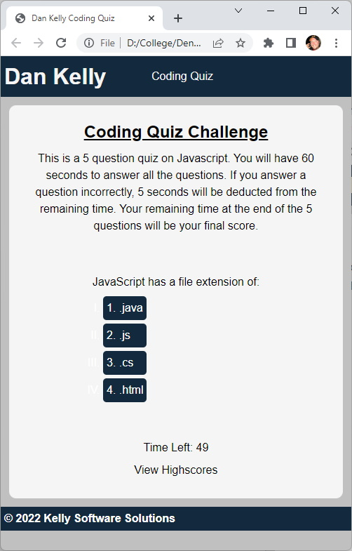
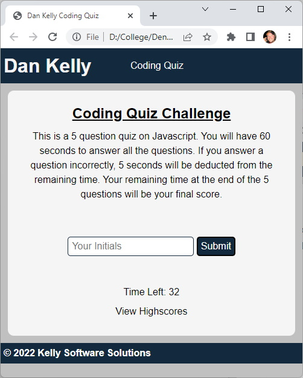
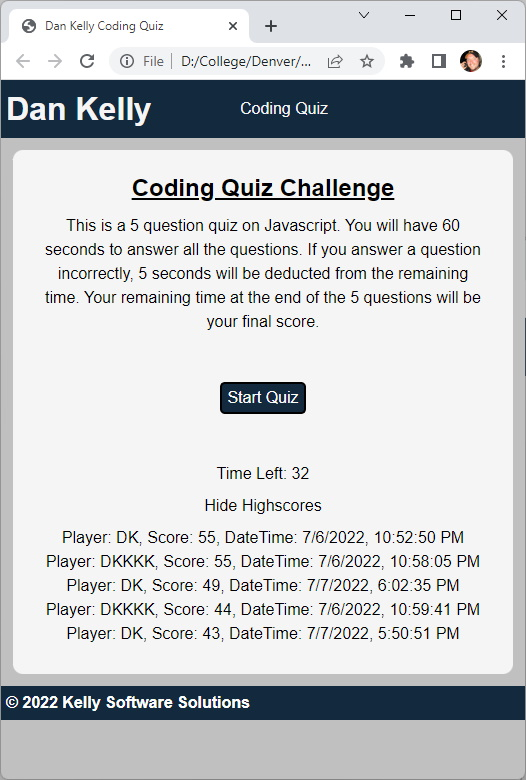

# Module 04 Challenge

The purpose of this challenge is to build a coding assessment.

## Description

A typical coding assessment includes both multiple-choice questions and interactive coding challenges. This will be a timed coding quiz with multiple-choice questions. This app will run in the browser and will feature dynamically updated HTML and CSS powered by JavaScript code.

### User Story

```
AS A coding boot camp student
I WANT to take a timed quiz on JavaScript fundamentals that stores high scores
SO THAT I can gauge my progress compared to my peers
```

### Acceptance Criteria

```
GIVEN I am taking a code quiz
WHEN I click the start button
THEN a timer starts and I am presented with a question
WHEN I answer a question
THEN I am presented with another question
WHEN I answer a question incorrectly
THEN time is subtracted from the clock
WHEN all questions are answered or the timer reaches 0
THEN the game is over
WHEN the game is over
THEN I can save my initials and my score
```

## Getting Started

### Dependencies

The use of a modern web browser.

### URL

- [https://dpk5e7.github.io/module04-challenge/](https://dpk5e7.github.io/module04-challenge/)

### Screenshots

TODO: Update Screenshots






## Authors

Dan Kelly
Daniel.Kelly@du.edu

## Version History

- 0.1
  - Initial Release

## License

This project is not licensed.

## Acknowledgments

- [Denver Coding Bootcamp](https://bootcamp.du.edu/)
